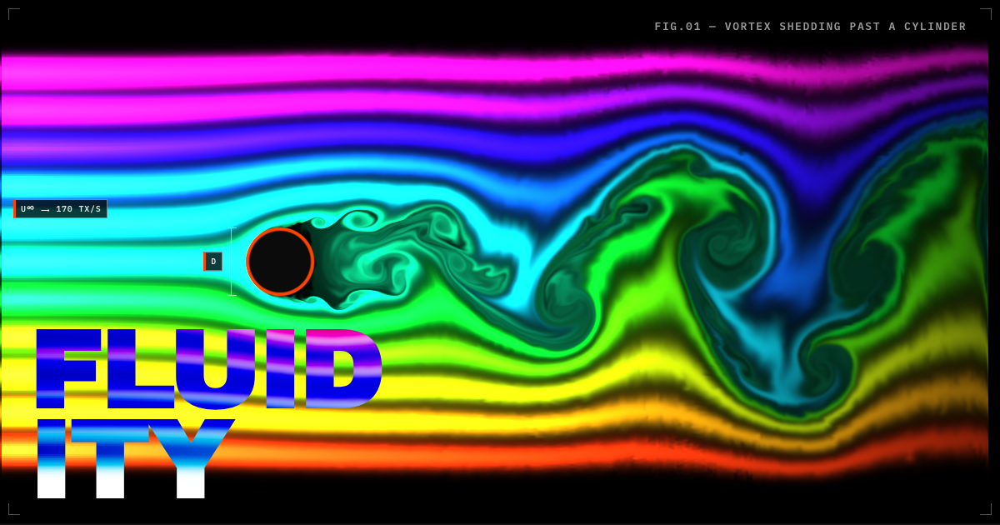

# FLUIDITY

A wind-tunnel test facility that happens to run in a browser.

Seven live fluid-dynamics experiments — a Kármán vortex street, a wing at angle
of attack, buoyant plumes, the Rayleigh–Taylor instability — solved on your GPU
at 60+ frames per second, with the mathematics explained equation by equation
next to the thing the equation governs.



**[Open the simulation →](https://oddurs.github.io/fluidity/)**

---

## What it actually is

The solver is Jos Stam's *Stable Fluids* method, written from scratch as WebGL2
fragment shaders — no physics library, no fluid framework. Every field
(velocity, pressure, divergence, curl, temperature, dye) is a half-float
texture, and every step of the simulation is one fullscreen shader pass over it.
About thirty passes per frame.

Per frame, in the order the sections of the essay are written:

1. **Wind** — freestream forcing at the tunnel inlet
2. **Buoyancy** — temperature exerts a vertical force (Boussinesq)
3. **Curl + confinement** — measure vorticity, then reinforce what the grid ate
4. **Divergence → Jacobi × N → project** — solve ∇²p = ∇·u and subtract ∇p
5. **Advect** — velocity carries itself, then the heat, then the dye

You can X-ray any of those fields while it runs, drag the obstacle through the
flow, park a probe anywhere to read live values, and hear the vortex shedding as
an aeolian tone whose pitch is measured from the pressure trace rather than
faked.

### It is honest about what it is not

The essay has a section called **What this gets wrong**, because a demo that
only tells you what it does well is selling something. The viscosity is an
accident of the grid rather than a material constant, so there is no
controllable Reynolds number. Vorticity confinement appears in no physical law.
It is two-dimensional, and 2D turbulence is a genuinely different phenomenon
from 3D rather than a simplification of it. Stam's paper is titled *Stable*
Fluids, not *Accurate* ones.

## Running it

```bash
npm install
npm run dev
```

Then open <http://localhost:3000>. You need a browser with WebGL2 and
`EXT_color_buffer_float`, which is every current desktop and mobile browser.

The tank is fully keyboard operable: `Tab` to focus it, arrows to move the
probe, `O` to switch to the obstacle, `Enter` to stir, `.` to hear the tank
described. Press `?` for the full map.

Anything on screen can leave with you. `STILL` writes a PNG plate — header,
full-bleed specimen, and a data block recording every parameter that produced
it — and `CLIP` (or `M`) records six seconds of that same plate as video, so a
result you can only describe in motion does not have to be described.

## Tests

```bash
npm test              # unit + end-to-end
npm run test:unit     # pure logic, no browser, no dependencies
npm run test:e2e      # Chromium, WebKit and Firefox
```

Unit tests run on Node's built-in runner against the TypeScript sources
directly — no build step and no test framework. The end-to-end suite asserts
physical behaviour rather than pixels: that flow reaches the outlet instead of
stalling before it, that the measured shedding frequency agrees with the
Strouhal number, that a lost GPU context recovers, that the dye keeps its colour
instead of blowing out to white. Each test names a bug that actually shipped.

## Layout

```
app/            Next.js routes, global stylesheet, favicon and share card
components/     Stage (canvas + render loop), ControlPanel, Annotations, Science
lib/fluid/      The solver and everything it needs
  shaders.ts      every GLSL program
  engine.ts       the FluidEngine: framebuffers, passes, the frame
  scenarios.ts    the seven experiments
  colormaps.ts    perceptually-uniform ramps and named inks
  quality.ts      adaptive resolution
  tone.ts         shedding-frequency estimation and the aeolian tone
  plate.ts        the export layout, shared by the still and the clip
  recorder.ts     MediaRecorder capture of the plate
e2e/            Playwright specs
DESIGN.md       the design system, and the reasoning behind it
```

`DESIGN.md` is worth reading before changing anything visual. It records the
decisions and, more usefully, the ones that were tried and rejected — why the
dye ramp keeps both limbs in the same half of the colour wheel, why the
instrument is dark, why motion has to name its job.

## Credits

- Jos Stam — *Stable Fluids*, SIGGRAPH 1999. The method.
- Ronald Fedkiw, Jos Stam, Henrik Wann Jensen — *Visual Simulation of Smoke*,
  SIGGRAPH 2001. Vorticity confinement.
- Mark Harris — *Fast Fluid Dynamics Simulation on the GPU*, GPU Gems ch. 38.
- Pavel Dobryakov — [WebGL-Fluid-Simulation](https://github.com/PavelDoGreat/WebGL-Fluid-Simulation),
  whose GPU formulation this solver follows.
- Nathaniel Smith and Stéfan van der Walt — the perceptually-uniform colormaps.

## Licence

[MIT](./LICENSE).
